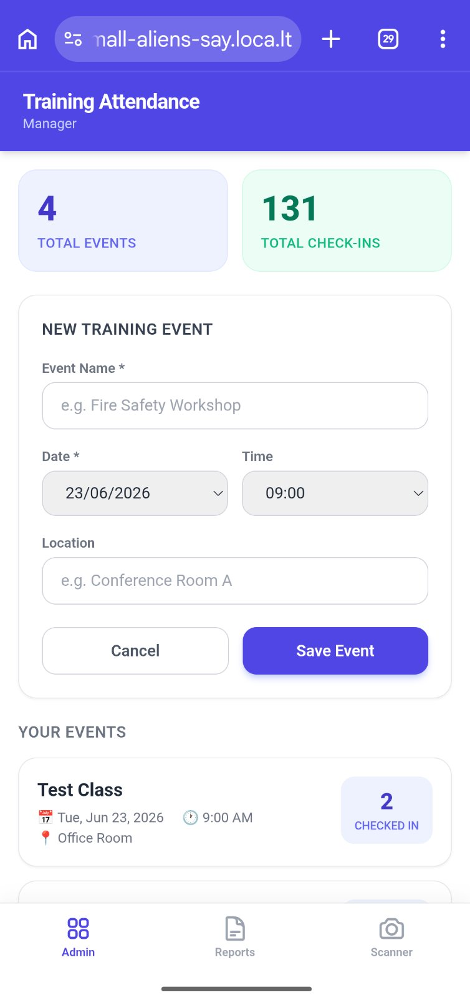
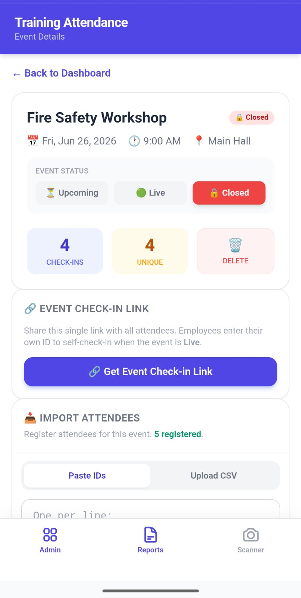
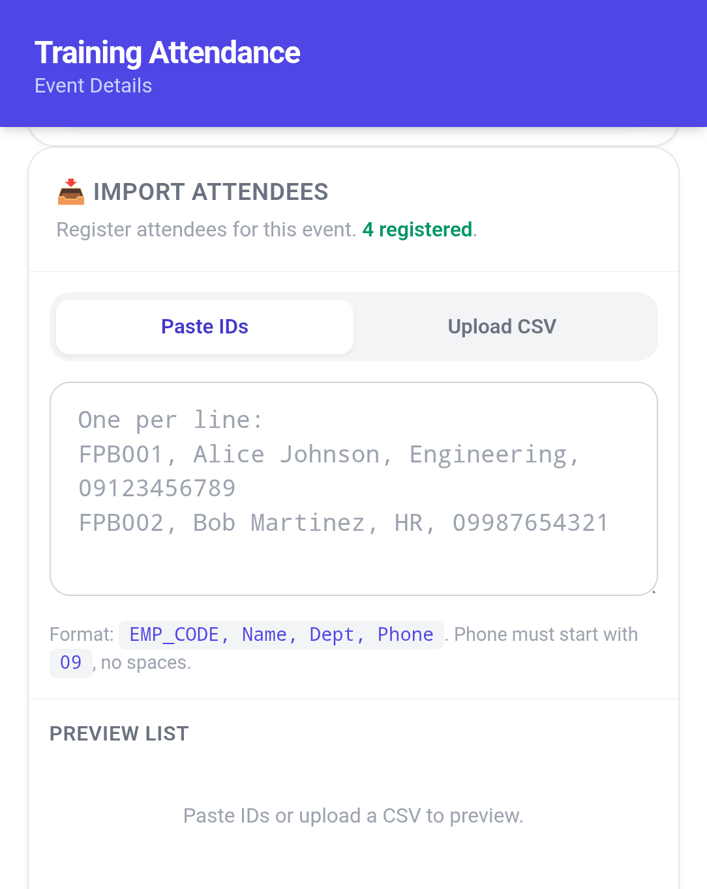
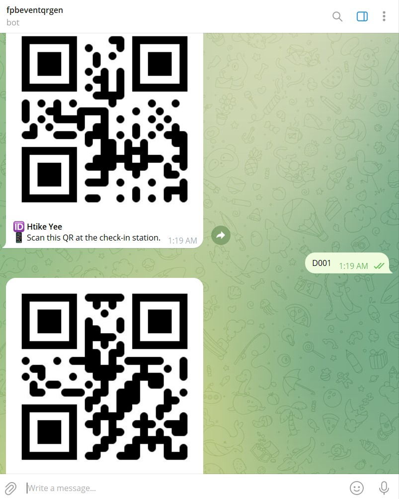
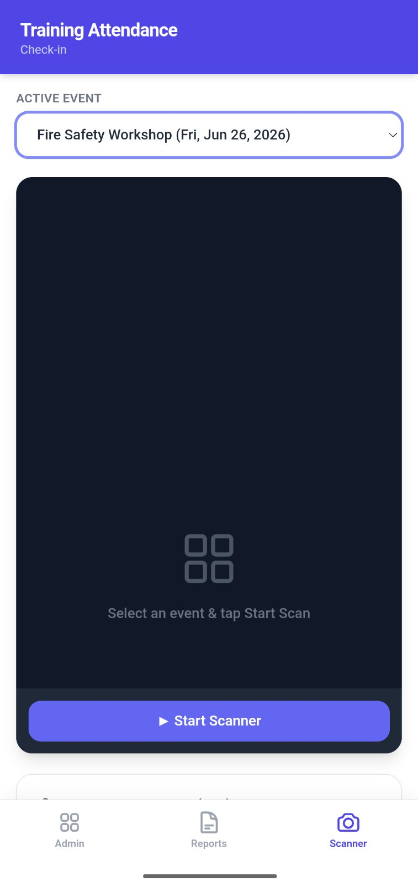
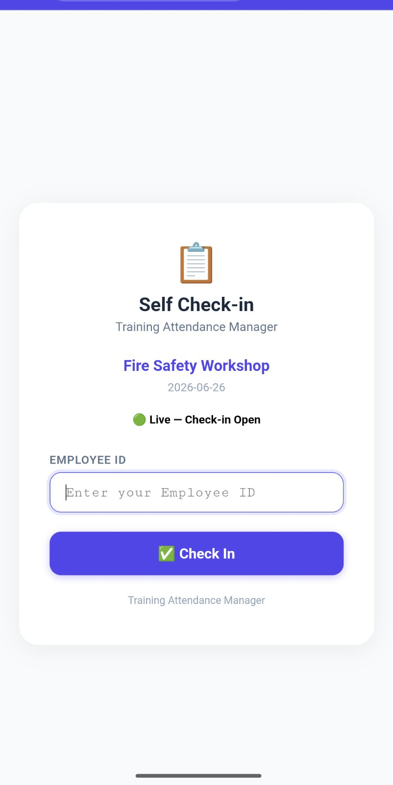
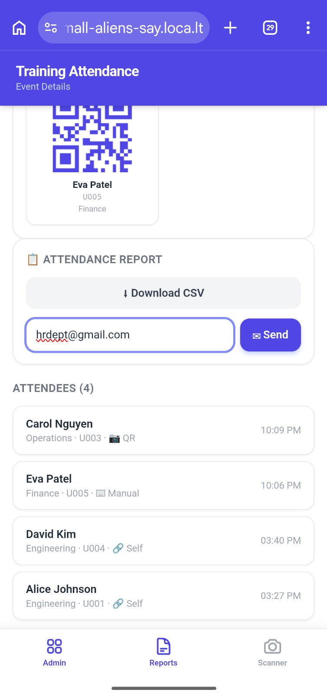
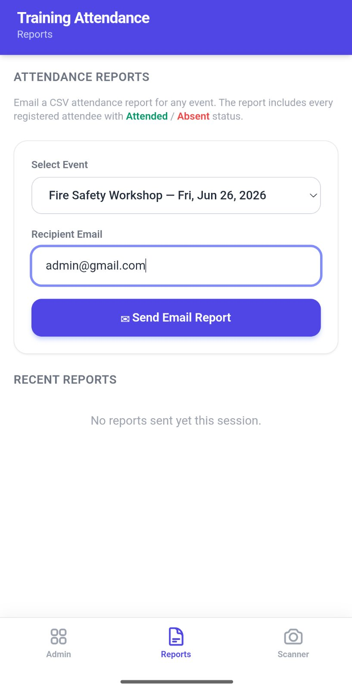

# QR-Based Training Attendance Manager

A lightweight, zero-dependency, full-stack solution for managing training attendance using QR codes and a Telegram Bot. 

## Features
* **PWA Frontend:** Mobile-friendly dashboard and QR scanner.
* **Telegram Bot Integration:** Auto-generates QR codes for registered attendees.
* **Offline-capable Database:** Uses SQLite for easy setup.
* **Email Reporting:** Sends attendance CSV reports directly via email.

## How to Run Locally
1. Clone this repository.
2. Ensure you have Python 3 installed.
3. Install dependencies for the bot: `pip install python-telegram-bot qrcode[pil] Pillow python-dotenv`
4. Rename `.env.example` to `.env`.
5. Open the `.env` file and replace the placeholder values with your actual Telegram Bot Token and Gmail App Password.
6. When you run `python3 app.py` for the first time, a fresh `attendance.db` will be created automatically.
7. Run the Web Server: `python3 app.py`
8. Run the Telegram Bot: `python3 qr_bot.py`
9. Open your browser and go to `http://localhost:5000`

## Screenshots

## End User Guide

📖 End User Guide(English Version)
This system is designed to provide a seamless experience for both training attendees and administrators.

1. For Attendees & Staff
Step 1 - Obtain Your QR Code

Open Telegram and search for the designated Training Bot.

Send the /start command and follow the prompts to enter your Name, Position, and Department.

Upon completion, the bot will instantly generate and send you a Unique QR Code. Keep this QR code ready when attending the training.

Step 2 - Check-In (Attendance)

Upon arriving at the training venue, open the Check-in URL provided by the Admin (You can also install it as a PWA app on your phone).

Tap the "Scan QR" button and use your device's camera to scan the QR Code from your Telegram.

Once the screen displays "Check-in Successful", your attendance has been successfully recorded.

2. For Admin / Trainers
Step 1 - Setup a New Event

Log into the Admin Dashboard and navigate to Setup Event.

Enter the Training Name, Date, and Time, then save the event with an "Upcoming" status.

Step 2 - Bulk Import Attendance

Prepare an Excel or CSV file containing the list of expected attendees (Name, Position, Department).

Go to the Import Attendance section in the Dashboard, select your file, and upload it.

This feature allows you to quickly register multiple staff members into the system at once without manual entry.

Step 3 - Event State Management (Open/Close Check-ins)

When it is time to accept attendees, change the respective event's status to "Live".

(Note: To prevent data mix-ups, the system strictly allows only one "Live" event at a time).

Once the training begins or the attendance window ends, change the status to "Closed" to prevent late check-ins.

Step 4 - Send Automated Email Reports

Navigate to the Email Reporting (Send Report) section in the Dashboard.

Select the completed training event from the dropdown menu and click Send.

The system will automatically convert the attendance data into a CSV file and email it to the designated HR or Management team.

မြန်မာဘာသာဖြင့် ဖတ်ရှုရန်

📖 End User Guide (အသုံးပြုသူများအတွက် လမ်းညွှန်)
ဤစနစ်သည် သင်တန်းတက်ရောက်သူများ (Attendees) နှင့် သင်တန်းစီစဉ်သူများ (Admin/Trainers) အတွက် အလွယ်တကူ အသုံးပြုနိုင်ရန် ရည်ရွယ်တည်ဆောက်ထားခြင်း ဖြစ်ပါသည်။

၁။ သင်တန်းသားများအတွက် (For Attendees & Staff)
အဆင့် (၁) - QR Code ရယူခြင်း

- မိမိဖုန်းရှိ Telegram မှတစ်ဆင့် သတ်မှတ်ထားသော Training Bot သို့ ဝင်ရောက်ပါ။

- /start ကိုနှိပ်၍ မိမိ၏ အမည်၊ ရာထူးနှင့် ဌာနအချက်အလက်များကို ညွှန်ကြားချက်အတိုင်း ဖြည့်သွင်းပါ။

- ဖြည့်သွင်းပြီးသည်နှင့် သင့်အတွက် သီးသန့် (Unique) QR Code တစ်ခုကို Bot မှ ချက်ချင်း ပေးပို့လာပါမည်။ (ထို QR   Code အား သင်တန်းသို့ လာရောက်ချိန်တွင် အသင့် ပြင်ဆင်ထားပါ)။

အဆင့် (၂) - Check-in ပြုလုပ်ခြင်း (Attendance)

- သင်တန်းခန်းမသို့ ရောက်ရှိချိန်တွင် Admin မှ ပေးထားသော Check-in URL သို့ ဝင်ရောက်ပါ (PWA App အနေဖြင့်လည်း   ဖုန်းတွင်   Install ပြုလုပ်ထားနိုင်သည်)။

- "Scan QR" ခလုတ်ကိုနှိပ်၍ ဖုန်းကင်မရာဖြင့် မိမိ၏ Telegram မှ QR Code ကို ဖတ်ခိုင်းပါ။

- မျက်နှာပြင်ပေါ်တွင် "Check-in Successful" ဟု ပေါ်လာပါက သင့်၏ တက်ရောက်မှုစာရင်း အောင်မြင်စွာ မှတ်တမ်း ဝင်သွားပြီ ဖြစ်  သည်။

၂။ သင်တန်းစီစဉ်သူများအတွက် (For Admin / Trainers)

အဆင့် (၁) - Event အသစ် ဖန်တီးခြင်း (Setup Event)

- Admin Dashboard သို့ ဝင်ရောက်၍ Setup Event ကို နှိပ်ပါ။

- သင်တန်းအမည်၊ နေ့စွဲ နှင့် အချိန်တို့ကို ဖြည့်သွင်းပြီး Event ကို "Upcoming" Status ဖြင့် သိမ်းဆည်းပါ။

- အဆင့် (၂) - သင်တန်းသားစာရင်း အစုလိုက်သွင်းယူခြင်း (Import Attendance)

- သင်တန်းတက်ရောက်မည့် ဝန်ထမ်းများ၏ အမည်၊ ရာထူး၊ ဌာန စသည့် အချက်အလက်များ ပါဝင်သော စာရင်း (Excel သို့မဟုတ် CSV ဖိုင်) ကို အသင့်ပြင်ဆင်ပါ။

- Admin Dashboard ရှိ Import Attendance ကဏ္ဍသို့ ဝင်ရောက်၍ အဆိုပါ ဖိုင်အား ရွေးချယ်ကာ Upload ပြုလုပ်ပါ။

- ဤစနစ်ဖြင့် သင်တန်းသားများ၏ အချက်အလက်များကို တစ်ဦးချင်း စာရင်းသွင်းနေစရာမလိုဘဲ တစ်ကြိမ်တည်းဖြင့် စနစ်ထဲသို့ အလွယ်တကူ Bulk Import ပြုလုပ် သိမ်းဆည်းနိုင်မည် ဖြစ်ပါသည်။

အဆင့် (၃) - Check-in အား ဖွင့်လှစ်ခြင်း နှင့် ပိတ်ခြင်း (Event State Management)

- သင်တန်းစတင်ခါနီး Check-in လက်ခံမည့်အချိန်တွင် သက်ဆိုင်ရာ Event ၏ Status ကို "Live" သို့ ပြောင်းလဲပေးပါ။

  (မှတ်ချက် - ဒေတာများ ရောထွေးမှု မဖြစ်စေရန် တစ်ကြိမ်လျှင် Live ဖြစ်နေသော Event တစ်ခုကိုသာ Check-in လက်ခံမည် ဖြစ်သည်။)

- သင်တန်းစတင်ပြီးနောက် (သို့မဟုတ်) အချိန်စေ့သွားပါက Event Status ကို "Closed" သို့ ပြောင်းလဲလိုက်ခြင်းဖြင့် နောက်ကျမှ Check-in ဝင်ရောက်ခြင်းများကို တားဆီးနိုင်ပါသည်။

အဆင့် (၄) - တက်ရောက်မှု စာရင်း (Report) ပေးပို့ခြင်း

- Dashboard မှတစ်ဆင့် Email Reporting (Send Report) ကဏ္ဍသို့ ဝင်ရောက်ပါ။

- Dropdown Menu မှ မိမိ Report ထုတ်လိုသော သက်ဆိုင်ရာ သင်တန်းကို ရွေးချယ်ပြီး Send ကို နှိပ်ပါ။

- တက်ရောက်သူစာရင်းအား CSV ဖိုင်အဖြစ် ပြောင်းလဲပြီး သက်ဆိုင်ရာ စီမံခန့်ခွဲသူများ (HR/Management) ၏ အီးမေးလ်များထံသို့ အလိုအလျောက် ပေးပို့သွားမည် ဖြစ်ပါသည်။