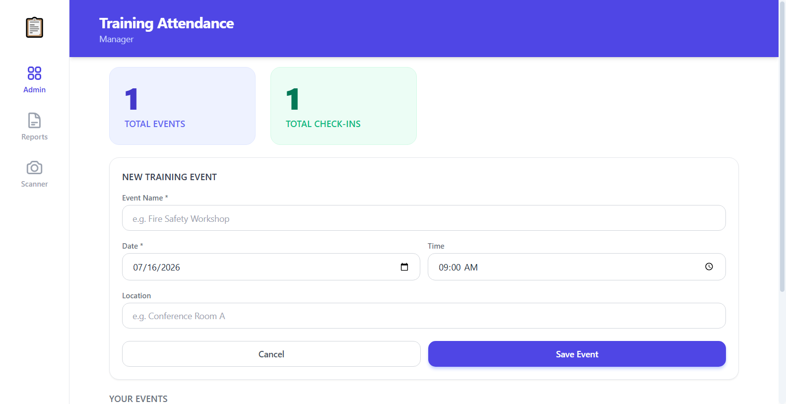
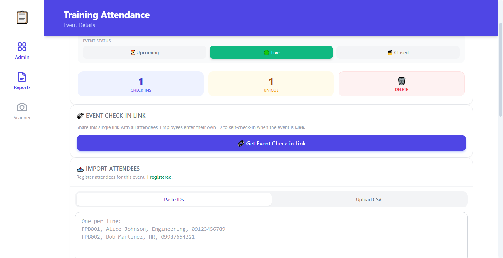
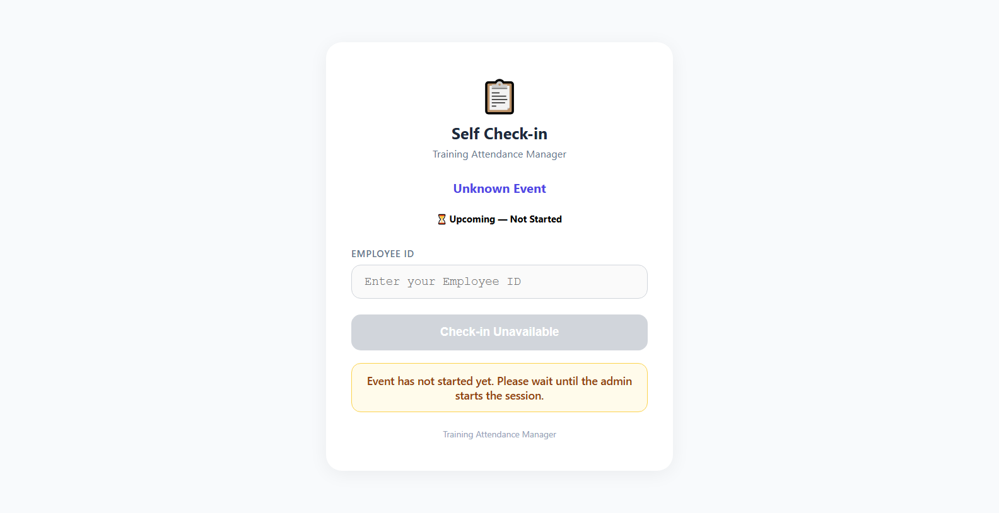
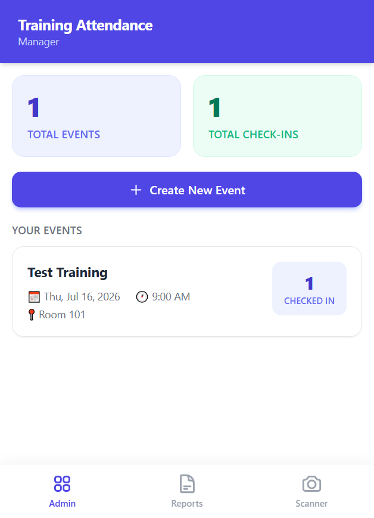
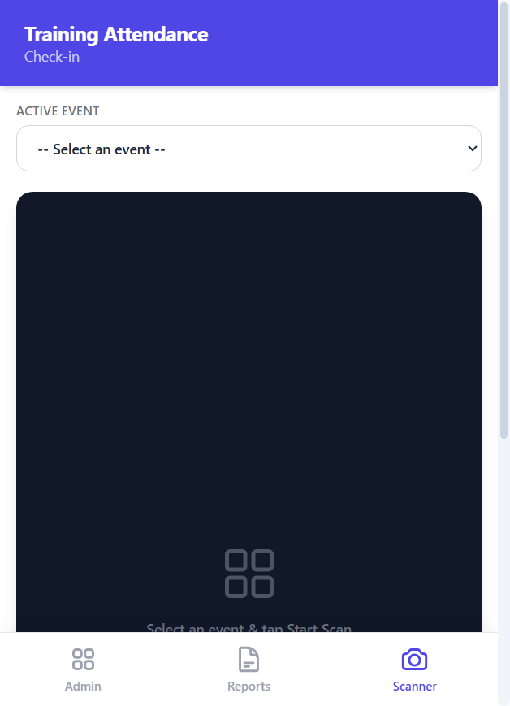
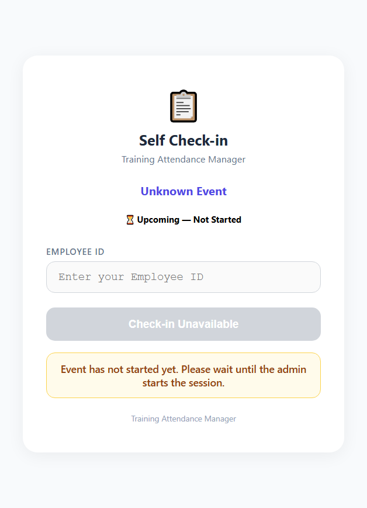

# Screenshot Guide for Chapter 6

This guide will help you take the required screenshots for Chapter 6 submission.

## Prerequisites

1. **Start the application:**
   ```bash
   # Terminal 1
   python3 app.py

   # Terminal 2
   python3 qr_bot.py
   ```

2. **Open Chrome browser** and go to: `http://localhost:5000`

## Required Screenshots

### Desktop Screenshots (1280×800)

#### 1. Admin Dashboard Desktop
- **Resolution:** 1280×800
- **What to capture:** Main dashboard with event list and stats
- **File name:** `01-dashboard-desktop.png`

**Steps:**
1. Open Chrome DevTools (F12 or Ctrl+Shift+I)
2. Click the device toolbar icon (Ctrl+Shift+M)
3. Set viewport to 1280×800
4. Navigate to `http://localhost:5000`
5. Wait for dashboard to load
6. Take screenshot (Ctrl+Shift+S or right-click → Capture screenshot)

#### 2. Create Event Form Desktop
- **Resolution:** 1280×800
- **What to capture:** Event creation form expanded
- **File name:** `02-create-event-desktop.png`

**Steps:**
1. Keep viewport at 1280×800
2. Click "Create New Event" button
3. Wait for form to expand
4. Take screenshot

#### 3. Event Detail Desktop
- **Resolution:** 1280×800
- **What to capture:** Event detail view with attendees
- **File name:** `03-event-detail-desktop.png`

**Steps:**
1. Keep viewport at 1280×800
2. Click on an existing event (or create one first)
3. Wait for event details to load
4. Take screenshot

#### 4. Self Check-in Page Desktop
- **Resolution:** 1280×800
- **What to capture:** Self-check-in page
- **File name:** `04-self-checkin-desktop.png`

**Steps:**
1. Keep viewport at 1280×800
2. Navigate to `http://localhost:5000/self-checkin?event_id=<your-event-id>`
3. Wait for page to load
4. Take screenshot

### Mobile Screenshots (390×844)

#### 5. Dashboard Mobile
- **Resolution:** 390×844
- **What to capture:** Mobile dashboard view
- **File name:** `05-dashboard-mobile.png`

**Steps:**
1. Open Chrome DevTools (F12 or Ctrl+Shift+I)
2. Click the device toolbar icon (Ctrl+Shift+M)
3. Set viewport to 390×844 (iPhone 12/13)
4. Navigate to `http://localhost:5000`
5. Wait for dashboard to load
6. Take screenshot

#### 6. QR Scanner Mobile
- **Resolution:** 390×844
- **What to capture:** QR scanner interface
- **File name:** `06-scanner-mobile.png`

**Steps:**
1. Keep viewport at 390×844
2. Click on "Scanner" tab in bottom navigation
3. Wait for scanner to load
4. Take screenshot

#### 7. Self Check-in Mobile
- **Resolution:** 390×844
- **What to capture:** Mobile self-check-in page
- **File name:** `07-self-checkin-mobile.png`

**Steps:**
1. Keep viewport at 390×844
2. Navigate to `http://localhost:5000/self-checkin?event_id=<your-event-id>`
3. Wait for page to load
4. Take screenshot

## Quick Method Using Chrome DevTools MCP

If you have Chrome DevTools MCP configured, use these prompts:

### Desktop Screenshots (1280×800)

```text
Use the chrome-devtools MCP. Set the viewport to 1280x800.
Open http://localhost:5000. Take a screenshot and save it as screenshots/01-dashboard-desktop.png.
```

```text
Use the chrome-devtools MCP. Set the viewport to 1280x800.
Open http://localhost:5000. Click on "Create New Event" and save screenshots/02-create-event-desktop.png.
```

### Mobile Screenshots (390×844)

```text
Use the chrome-devtools MCP. Set the viewport to 390x844.
Open http://localhost:5000. Take a screenshot and save it as screenshots/05-dashboard-mobile.png.
```

## Screenshot Checklist

- [ ] `01-dashboard-desktop.png` - Admin dashboard (1280×800)
- [ ] `02-create-event-desktop.png` - Create event form (1280×800)
- [ ] `03-event-detail-desktop.png` - Event detail view (1280×800)
- [ ] `04-self-checkin-desktop.png` - Self-check-in page (1280×800)
- [ ] `05-dashboard-mobile.png` - Mobile dashboard (390×844)
- [ ] `06-scanner-mobile.png` - QR scanner (390×844)
- [ ] `07-self-checkin-mobile.png` - Mobile self-check-in (390×844)

## Tips for Good Screenshots

1. **Ensure the app is fully loaded** - Wait for all elements to render
2. **Use consistent resolution** - Stick to 1280×800 for desktop, 390×844 for mobile
3. **Capture clean state** - No error messages or loading spinners
4. **Show important features** - Dashboard stats, event list, check-in form
5. **File naming** - Use the exact names specified above

## Where to Save Screenshots

Save all screenshots in the `screenshots/` directory:

```
qr-training-manager/
├── screenshots/
│   ├── 01-dashboard-desktop.png
│   ├── 02-create-event-desktop.png
│   ├── 03-event-detail-desktop.png
│   ├── 04-self-checkin-desktop.png
│   ├── 05-dashboard-mobile.png
│   ├── 06-scanner-mobile.png
│   └── 07-self-checkin-mobile.png
```

## Updating the Report

After taking screenshots, update the `ch-6-report.md` file with the correct screenshot references:

```markdown
## Updated Screenshots

- **Resolution used:** 1280×800 desktop, 390×844 mobile








```

## Need Help?

If you encounter any issues while taking screenshots, check:

1. **App is running** - Ensure `python3 app.py` is running
2. **Correct URL** - Use `http://localhost:5000`
3. **Event exists** - Create an event before taking screenshots
4. **Chrome DevTools** - Make sure device toolbar is enabled

---

**Good luck with your Chapter 6 submission!** 📸
