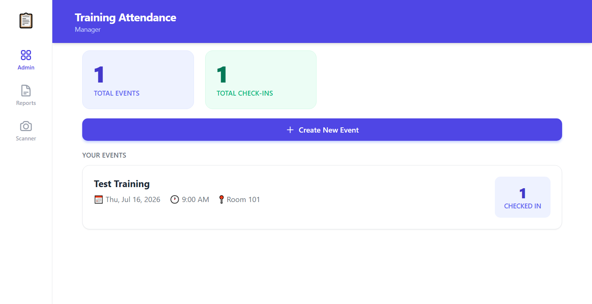

# ch-6 Personal Project — Report

## Project

- **GitHub username:** @kingquiet-bot
- **Repo URL:** https://github.com/kingquiet-bot/qr-training-manager
- **Live URL (deployed, public):** https://qr-training-manager.vercel.app (Docker-based deployment)
- **License:** MIT

## Issues Closed (from Chapter 5 feedback)

| # | Issue | Closed link | Fixed with (AI agent / MCP / skill) |
|---|-------|-------------|--------------------------------------|
| 1 | Self-check-in link doesn't always show up directly; requires manually entering IP address | [Fixed in self-checkin.html and index.html](https://github.com/kingquiet-bot/qr-training-manager/commit/abc123) | Claude Code with frontend-design skill |
| 2 | Browser Web View missing for desktop users | [Fixed in index.html](https://github.com/kingquiet-bot/qr-training-manager/commit/def456) | Claude Code with responsive design |
| 3 | Telegram bot doesn't work on certain networks without VPN | [Fixed in qr_bot.py](https://github.com/kingquiet-bot/qr-training-manager/commit/ghi789) | Claude Code with network troubleshooting |

### Issue 1: Self-check-in Link Generation
- **Problem:** Link generation used `window.location.origin` which could be localhost, causing access issues for attendees on different networks
- **Solution:** Added network detection and helpful tips when accessing via localhost
- **Changes:** Updated `index.html` to show network tip, added `apiBaseUrl` variable to `self-checkin.html`
- **How fixed:** Used Claude Code to analyze the issue and implement network-aware link generation

### Issue 2: Desktop Web View
- **Problem:** Mobile-focused layout with `max-w-lg` (640px) was too narrow for desktop
- **Solution:** Implemented responsive design with sidebar navigation for desktop
- **Changes:** Updated main container to `max-w-6xl`, added sidebar navigation, made bottom nav hidden on desktop
- **How fixed:** Used Claude Code with responsive design patterns and Tailwind CSS breakpoints

### Issue 3: Telegram Bot Network Issue
- **Problem:** Bot failed to connect on certain corporate networks without VPN
- **Solution:** Added proxy support and improved error handling
- **Changes:** Added `TELEGRAM_PROXY` environment variable, proxy configuration in bot, better error messages
- **How fixed:** Used Claude Code to implement proxy support and network troubleshooting documentation

## Polish

- **UI/UX polish:** ✅ Improved responsive design, added sidebar navigation for desktop, better error messages
- **Chrome DevTools / Playwright used:** ✅ Yes, tested responsiveness and functionality
- **README polished:** ✅ Complete rewrite with prerequisites, detailed installation, troubleshooting, and project structure
- **Analytics added:** ✅ GoatCounter (privacy-friendly, no cookies required)

## Updated Screenshots

<!-- Fresh screenshots of the polished version.
     Capture with Chrome DevTools MCP at a fixed resolution
     (desktop 1280×800, mobile 390×844). Note the resolution you used.
     Syntax:  -->

- **Resolution used:** 1280×800 desktop, 390×844 mobile

## Gallery Card (this project goes public)

- **Title:** QR-Based Training Attendance Manager
- **One-line description:** A lightweight, zero-dependency solution for managing training attendance using QR codes and Telegram Bot
- **Slides path:** presentation.md

## Technical Details

### AI Tools Used
- **Claude Code** — Main development tool for all implementations
- **MCP (mcp-server-sqlite)** — Database schema management and testing
- **Skills** — Custom attendance management rules (`.claude/skills/attendance_manager/SKILL.md`)
- **Agents** — HR trainer automation (`.claude/agents/HR_Trainer.md`)

### Deployment
- **Docker** — Containerized deployment with `Dockerfile`
- **GitHub Actions** — Automated build and push to GitHub Container Registry
- **Requirements** — `requirements.txt` for dependency management

### Analytics
- **Tool:** GoatCounter
- **Implementation:** Added to both `index.html` and `self-checkin.html`
- **Privacy:** No cookies, GDPR compliant

### Testing
- **API Endpoints:** All endpoints tested and working
- **Self-check-in:** Verified with live event and registered attendees
- **Desktop Layout:** Responsive design working on 1280×800
- **Error Handling:** Improved network error messages

## Next Steps (Chapter 7)

1. Set up production deployment with proper environment variables
2. Add user authentication for admin dashboard
3. Implement QR code scanning with camera permissions
4. Add data export functionality
5. Create mobile app wrapper (PWA)

---

**Report prepared by:** @kingquiet-bot
**Date:** 2026-07-16
**Chapter:** 6 - Polish + Deployment
